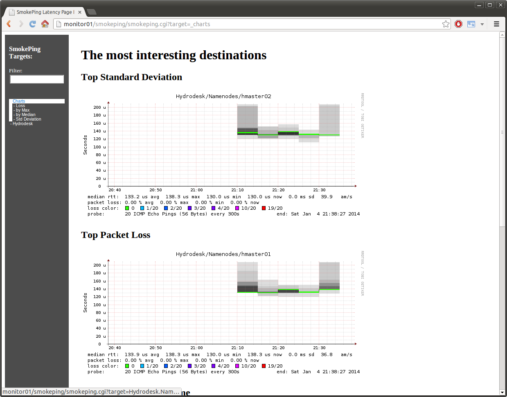

Hadoop Ansible Playbook [](https://travis-ci.org/analytically/hadoop-ansible) [](https://bitdeli.com/free "Bitdeli Badge")
=======================

[Ansible](http://www.ansibleworks.com/) playbook that installs a CDH 4.6.0 [Hadoop](http://hadoop.apache.org/)
cluster (running on Java 7, supported from [CDH 4.4](http://www.cloudera.com/content/cloudera-content/cloudera-docs/CDH4/latest/CDH4-Release-Notes/Whats_New_in_4-4.html)),
with [HBase](http://hbase.apache.org/), Hive, [Presto](http://prestodb.io/) for analytics, and [Ganglia](http://ganglia.sourceforge.net/),
[Smokeping](http://oss.oetiker.ch/smokeping/), [Fluentd](http://fluentd.org/), [Elasticsearch](http://www.elasticsearch.org/)
and [Kibana](http://www.elasticsearch.org/overview/kibana/) for monitoring and centralized log indexing.

Hire/Follow [@analytically](http://twitter.com/analytically). Browse the CI [build screenshots](http://hadoop-ansible.s3-website-us-east-1.amazonaws.com/#artifacts/).

### Requirements

  - [Ansible](http://www.ansibleworks.com/) 1.5 or later (`pip install ansible`)
  - 6 + 1 Ubuntu 12.04 LTS/13.04/13.10 or Debian "wheezy" hosts - see [ubuntu-netboot-tftp](https://github.com/analytically/ubuntu-netboot-tftp) if you need automated server installation
  - [Mandrill](http://mandrill.com/) username and API key for sending email notifications
  - `ansibler` user in sudo group without sudo password prompt (see Bootstrapping section below)

### Cloudera ([CDH4](http://www.cloudera.com/content/support/en/documentation/cdh4-documentation/cdh4-documentation-v4-latest.html)) Hadoop Roles

If you're assembling your own Hadoop playbook, these roles are available for you to reuse:

  - [`cdh_common`](roles/cdh_common/) - sets up Cloudera's Ubuntu repository and key
  - [`cdh_hadoop_common`](roles/cdh_hadoop_common/) - common packages shared by all Hadoop nodes
  - [`cdh_hadoop_config`](roles/cdh_hadoop_config/) - common configuration shared by all Hadoop nodes
  - [`cdh_hadoop_datanode`](roles/cdh_hadoop_datanode/) - installs Hadoop DataNode
  - [`cdh_hadoop_journalnode`](roles/cdh_hadoop_journalnode/) - installs Hadoop JournalNode
  - [`cdh_hadoop_mapreduce`](roles/cdh_hadoop_mapreduce/) - installs Hadoop MapReduce
  - [`cdh_hadoop_mapreduce_historyserver`](roles/cdh_hadoop_mapreduce_historyserver/) - installs Hadoop MapReduce history server
  - [`cdh_hadoop_namenode`](roles/cdh_hadoop_namenode/) - installs Hadoop NameNode
  - [`cdh_hadoop_yarn_nodemanager`](roles/cdh_hadoop_yarn_nodemanager/) - installs Hadoop YARN node manager
  - [`cdh_hadoop_yarn_proxyserver`](roles/cdh_hadoop_yarn_proxyserver/) - installs Hadoop YARN proxy server
  - [`cdh_hadoop_yarn_resourcemanager`](roles/cdh_hadoop_yarn_resourcemanager/) - installs Hadoop YARN resource manager
  - [`cdh_hadoop_zkfc`](roles/cdh_hadoop_zkfc/) - installs Hadoop Zookeeper Failover Controller
  - [`cdh_hbase_common`](roles/cdh_hbase_common/) - common packages shared by all HBase nodes
  - [`cdh_hbase_config`](roles/cdh_hbase_common/) - common configuration shared by all HBase nodes
  - [`cdh_hbase_master`](roles/cdh_hbase_master/) - installs HBase-Master
  - [`cdh_hbase_regionserver`](roles/cdh_hbase_regionserver/) - installs HBase RegionServer
  - [`cdh_hive_common`](roles/cdh_hive_common/) - common packages shared by all Hive nodes
  - [`cdh_hive_config`](roles/cdh_hive_config/) - common configuration shared by all Hive nodes
  - [`cdh_hive_metastore`](roles/cdh_hive_metastore/) - installs Hive metastore (with PostgreSQL database)
  - [`cdh_zookeeper_server`](roles/cdh_zookeeper_server/) - installs ZooKeeper Server

### [Facebook Presto](http://prestodb.io/) Roles

  - [`presto_common`](roles/presto_common/) - downloads Presto to /usr/local/presto and prepares the node configuration
  - [`presto_coordinator`](roles/presto_coordinator/) - installs Presto coordinator config
  - [`presto_worker`](roles/presto_worker/) - installs Presto worker config

### Configuration

Set the following variables using `--extra-vars` or editing [`group_vars/all`](group_vars/all):

Required:

- `site_name` - used as Hadoop nameservices and various directory names. Alphanumeric only.

Optional:

- Email notification: `notify_email`, `postfix_domain`, `mandrill_username`, `mandrill_api_key`
- [`roles/common`](roles/common/defaults/main.yml): `kernel_swappiness`(0), `nofile` limits, ntp servers and `rsyslog_polling_interval_secs`(10)
- [`roles/2_aggregated_links`](roles/2_aggregated_links/defaults/main.yml): `bond_mode` (balance-alb) and `mtu` (9216)
- [`roles/cdh_hadoop_config`](roles/cdh_hadoop_config/defaults/main.yml): `dfs_blocksize` (268435456), `max_xcievers` (4096), `heapsize` (12278)

#### Adding hosts

Edit the [hosts](hosts) file and list hosts per group (see [Inventory](http://www.ansibleworks.com/docs/intro_inventory.html) for more examples):

```
[datanodes]
hslave010
hslave[090:252]
hadoop-slave-[a:f].example.com
```

Make sure that the `zookeepers` and `journalnodes` groups contain at least 3 hosts and have an odd number of hosts.

#### Ganglia nodes

Since we're using unicast mode for Ganglia (which significantly reduces chatter), you may have to wait 60 seconds
after node startup before it is seen/shows up in the web interface.

### Installation

To run Ansible:

```sh
./site.sh
```

To e.g. just install ZooKeeper, add the `zookeeper` tag as argument (available tags: apache, bonding, configuration,
elasticsearch, elasticsearch_curator, fluentd, ganglia, hadoop, hbase, hive, java, kibana, ntp, postfix, postgres, presto,
rsyslog, tdagent, zookeeper):

```sh
./site.sh zookeeper
```

#### What else is installed?

  - To improve performance, [sysctl tuning](roles/common/templates/sysctl.conf)
  - [link aggregation](roles/2_aggregated_links/templates/interfaces) configures [Link Aggregation](https://help.ubuntu.com/community/UbuntuBonding) if 2 interfaces are available
  - [htop](http://htop.sourceforge.net/), curl, checkinstall, heirloom-mailx, intel-microcode/amd64-microcode, net-tools, zip
  - [NTP](http://www.ntp.org/) configured with the [Oxford University NTP service](http://www.oucs.ox.ac.uk/network/ntp/) by default
  - [Postfix](http://www.postfix.org/) with [Mandrill](http://mandrill.com/) configuration
  - unattended upgrades [email to inform success/failure](roles/postfix_mandrill/templates/50unattended-upgrades)
  - php5-cli, sysstat, hddtemp to report [device metrics](roles/ganglia_monitor/templates/device-metrics.php)
    (reads/writes/temp) to Ganglia [every 10 minutes](roles/ganglia_monitor/templates/device-metrics.cron.d)
  - LZO (Lempel–Ziv–Oberhumer) and [Google Snappy 1.1.1](https://code.google.com/p/snappy/) compression
  - a [fork of openjdk's FloatingDecimal](https://github.com/airlift/floatingdecimal) to fix monitor contention when parsing doubles due to a static synchronized method
  - [Elasticsearch Curator](https://github.com/elasticsearch/curator), defaults to maximum 30 GB of data in Elasticsearch, via cron daily at 2:00AM
  - [Elasticsearch Marvel](http://www.elasticsearch.org/overview/marvel/), monitor your Elasticsearch cluster's heartbeat
  - [SmokePing](http://oss.oetiker.ch/smokeping/) to keep track of network latency

#### URL's

After the installation, go here:

  - Ganglia at [monitor01/ganglia](http://monitor01/ganglia/)
  - Kibana at [monitor01/kibana/index.html#/dashboard/file/logstash.json](http://monitor01/kibana/index.html#/dashboard/file/logstash.json)
  - Smokeping at [monitor01/smokeping/smokeping.cgi](http://monitor01/smokeping/smokeping.cgi)
  - hmaster01 at [hmaster01:50070](http://hmaster01:50070) - active namenode
  - hmaster02 at [hmaster02:50070](http://hmaster02:50070) - standby namenode
  - Presto at [hmaster02:8081](http://hmaster02:8081) - Presto coordinator

### Performance testing

Instructions on how to test the performance of your CDH4 cluster.

  - SSH into one of the machines.
  - Change to the `hdfs` user: `sudo su - hdfs`
  - Set HADOOP_MAPRED_HOME: `export HADOOP_MAPRED_HOME=/usr/lib/hadoop-mapreduce`
  - `cd /usr/lib/hadoop-mapreduce`

##### TeraGen and TeraSort

  - `hadoop jar hadoop-mapreduce-examples.jar teragen -Dmapred.map.tasks=1000 10000000000 /tera/in` to run TeraGen
  - `hadoop jar hadoop-mapreduce-examples.jar terasort /tera/in /tera/out` to run TeraSort

##### DFSIO

  - `hadoop jar hadoop-mapreduce-client-jobclient-2.0.0-cdh4.6.0-tests.jar TestDFSIO -write`

### Bootstrapping

Paste your public SSH RSA key in `bootstrap/ansible_rsa.pub` and run `bootstrap.sh` to bootstrap the nodes
specified in `bootstrap/hosts`. See [`bootstrap/bootstrap.yml`](bootstrap/bootstrap.yml) for more information.

### What about Pig, Flume, etc?

You can manually install additional components after running this playbook. Follow the
official [CDH4 Installation Guide](http://www.cloudera.com/content/cloudera-content/cloudera-docs/CDH4/latest/CDH4-Installation-Guide/CDH4-Installation-Guide.html).

### Screenshots




### License

Licensed under the [Apache License, Version 2.0](http://www.apache.org/licenses/LICENSE-2.0).

Copyright 2013-2014 [Mathias Bogaert](mailto:mathias.bogaert@gmail.com).