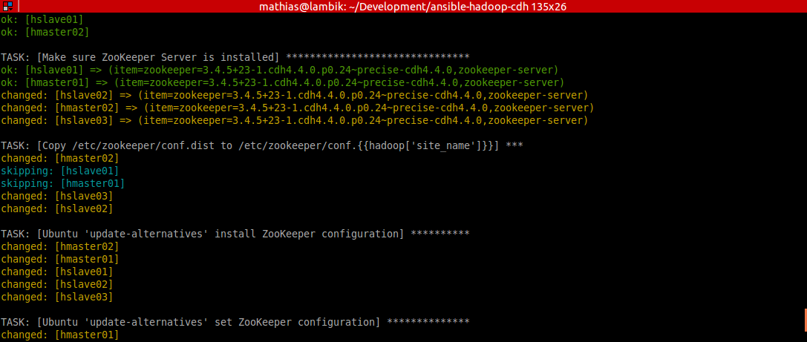
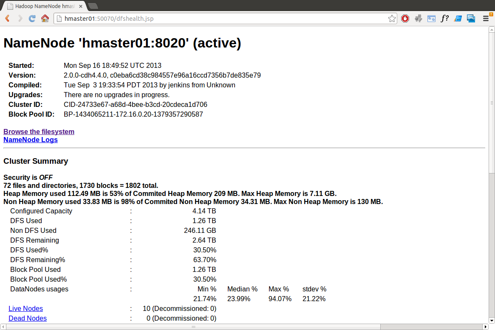
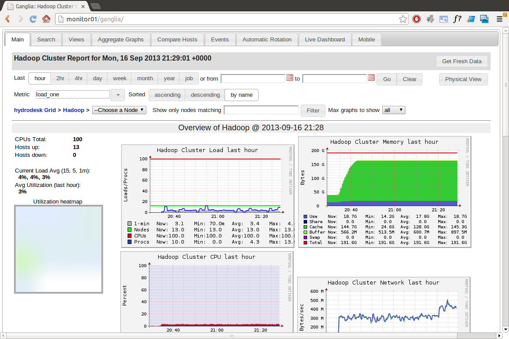
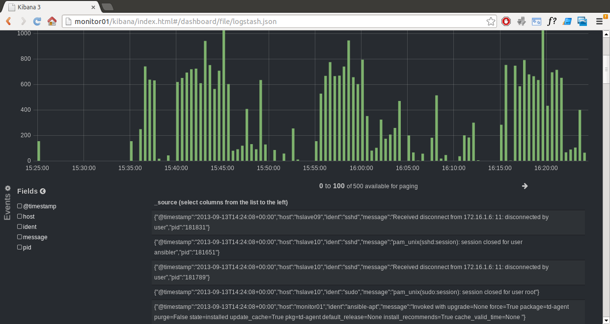

Hadoop Ansible Playbook
=======================

[Ansible](http://www.ansibleworks.com/) Playbook that installs a [Hadoop](http://hadoop.apache.org/)
cluster (running on Java 7, supported from [CDH 4.4](http://www.cloudera.com/content/cloudera-content/cloudera-docs/CDH4/latest/CDH4-Release-Notes/Whats_New_in_4-4.html)),
with [Ganglia](http://ganglia.sourceforge.net/), [Fluentd](http://fluentd.org/), [ElasticSearch](http://www.elasticsearch.org/)
and [Kibana 3](http://www.elasticsearch.org/overview/kibana/) for monitoring and centralized log indexing.

Follow [@analytically](http://twitter.com/analytically) for updates.

### Requirements

  - Ansible 1.3
  - Ubuntu (tested on 12.04.3, 13.04 and 13.10)
  - `ansibler` user in sudo group without sudo password prompt (see Bootstrapping section below)

### Available Cloudera ([CDH4](http://www.cloudera.com/content/support/en/documentation/cdh4-documentation/cdh4-documentation-v4-latest.html)) Hadoop Roles

If you're assembling your own Hadoop playbook, these roles are available for you to reuse:

  - [`cdh_common`](roles/cdh_common/) - sets up Cloudera's Ubuntu repository and key
  - [`cdh_hadoop_common`](roles/cdh_hadoop_cmmon/) - common packages shared by all Hadoop/HBase nodes
  - [`cdh_hadoop_config`](roles/cdh_hadoop_config/) - common configuration shared by all Hadoop nodes
  - [`cdh_hbase_config`](roles/cdh_hbase_config/) - common configuration shared by all HBase nodes
  - [`cdh_hadoop_datanode`](roles/cdh_hadoop_datanode/) - installs Hadoop DataNode
  - [`cdh_hadoop_journalnode`](roles/cdh_hadoop_journalnode/) - installs Hadoop JournalNode
  - [`cdh_hadoop_mapreduce`](roles/cdh_hadoop_mapreduce/) - installs Hadoop MapReduce
  - [`cdh_hadoop_mapreduce_historyserver`](roles/cdh_hadoop_mapreduce_historyserver/) - installs Hadoop MapReduce history server
  - [`cdh_hadoop_namenode`](roles/cdh_hadoop_namenode/) - installs Hadoop NameNode
  - [`cdh_hadoop_yarn_nodemanager`](roles/cdh_hadoop_yarn_nodemanager/) - installs Hadoop YARN node manager
  - [`cdh_hadoop_yarn_proxyserver`](roles/cdh_hadoop_yarn_proxyserver/) - installs Hadoop YARN proxy server
  - [`cdh_hadoop_yarn_resourcemanager`](roles/cdh_hadoop_yarn_resourcemanager/) - installs Hadoop YARN resource manager
  - [`cdh_hadoop_zkfc`](roles/cdh_hadoop_zkfc/) - installs Hadoop Zookeeper Failover Controller
  - [`cdh_hbase_master`](roles/cdh_hbase_master/) - installs HBase-Master
  - [`cdh_hbase_regionserver`](roles/cdh_hbase_regionserver/) - installs HBase RegionServer
  - [`cdh_zookeeper_server`](roles/cdh_zookeeper_server/) - installs ZooKeeper Server

### Configure

Make sure you customize the following files:

- [`group_vars/all`](group_vars/all) - site_name and notify_email
- [`roles/postfix_mandrill/defaults/main.yml`](roles/postfix_mandrill/defaults/main.yml) - set your [Mandrill](http://mandrill.com/) account (API key)
- [`roles/cdh_hadoop_config/defaults/main.yml`](roles/cdh_hadoop_config/defaults/main.yml) - Hadoop settings

#### Ganglia nodes

Since we're using unicast mode for Ganglia (which significantly reduces the chatter), you may have to wait 60 seconds
after node startup before it is seen/shows up in the web interface.

### Installing Hadoop

To run Ansible:

```sh
./site.sh
```

To e.g. just install ZooKeeper, add the `zookeeper` tag as argument (available tags: apache, bonding, configuration,
elasticsearch, fluentd, ganglia, hadoop, hbase, java, kibana, ntp, rsyslog, tdagent, zookeeper):

```sh
./site.sh zookeeper
```

#### What else is installed?

  - [Htop](http://htop.sourceforge.net/)
  - [SSHGuard](http://www.sshguard.net/)
  - curl, checkinstall, intel-microcode, net-tools, zip
  - [NTP](http://www.ntp.org/) configured with the [Oxford University NTP service](http://www.oucs.ox.ac.uk/network/ntp/) by default
  - [Postfix](http://www.postfix.org/) with [Mandrill](http://mandrill.com/) configuration
  - [local 'apt' repository for Oracle Java packages](https://github.com/flexiondotorg/oab-java6)
  - unattended upgrades [email to inform success/failure](roles/postfix_mandrill/templates/50unattended-upgrades)
  - php5-cli, sysstat, hddtemp to report [device metrics](roles/ganglia_monitor/templates/device-metrics.php)
    (reads/writes/temp) to Ganglia [every 10 minutes](roles/ganglia_monitor/templates/device-metrics.cron.d).
  - LZO (Lempel–Ziv–Oberhumer) and [Google Snappy 1.1.1](https://code.google.com/p/snappy/) compression

### Performance testing

Instructions on how to test the performance of your CDH4 cluster.

  - SSH into one of the machines.
  - Change to the `hdfs` user: `sudo su - hdfs`
  - Set HADOOP_MAPRED_HOME: `export HADOOP_MAPRED_HOME=/usr/lib/hadoop-mapreduce`
  - `cd /usr/lib/hadoop-mapreduce`

##### TeraGen and TeraSort

  - `hadoop jar hadoop-mapreduce-examples.jar teragen -Dmapred.map.tasks=1000 10000000000 /tera/in` to run TeraGen
  - `hadoop jar hadoop-mapreduce-examples.jar terasort /tera/in /tera/out` to run TeraSort

##### DFSIO

  - `hadoop jar hadoop-mapreduce-client-jobclient-2.0.0-cdh4.4.0-tests.jar TestDFSIO -write`

### Bootstrapping

Paste your public SSH RSA key in `bootstrap/ansible_rsa.pub` and run `bootstrap.sh` to bootstrap the nodes
specified in `bootstrap/hosts`. See [`bootstrap/bootstrap.yml`](bootstrap/bootstrap.yml) for more information.

### Cluster-wide SSH

If you feel like using Ansible to run cluster-wide commands is overkill, take a look at
[ClusterSSH](http://sourceforge.net/apps/mediawiki/clusterssh/index.php?title=Main_Page).

To install:

```sh
apt-get install clusterssh
```

To open a SSH connection to all nodes used in this playbook:

```sh
./cssh.sh
```

### What about Pig, Hive, Flume, etc?

You can manually install additional components after running this playbook. Follow the
official [CDH4 Installation Guide](http://www.cloudera.com/content/cloudera-content/cloudera-docs/CDH4/latest/CDH4-Installation-Guide/CDH4-Installation-Guide.html).

### Screenshots









### License

Licensed under the [Apache License, Version 2.0](http://www.apache.org/licenses/LICENSE-2.0).

Copyright 2013 [Mathias Bogaert](mailto:mathias.bogaert@gmail.com).